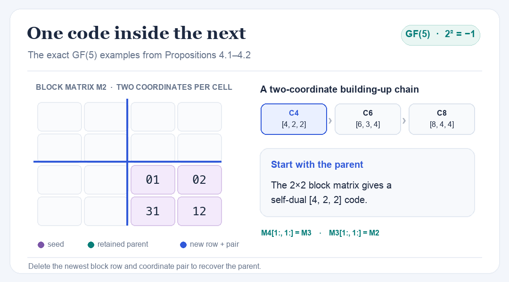

# Building-up self-dual codes

Formal proofs and reproducible computations for
[*Formalizing building-up constructions of self-dual codes through isotropic lines in Lean*](https://arxiv.org/abs/2604.08485).

<p align="center">
  
</p>

<p align="center"><sub>The actual matrices from Propositions 4.1–4.2, animated one coordinate pair at a time. <a href="assets/render_gf5_chain.py">Animation source</a>.</sub></p>

## Read the construction

Over $\mathbb F_5$, the choice $c=2$ satisfies $c^2=-1$. The paper's split boxed construction adds **one generator row and two coordinates** at each step. In the animation, each cell is a pair of field elements. The lower-right blocks stay exactly the same:

$$
M_2\;[4,2,2]
\quad\longrightarrow\quad
M_3\;[6,3,4]
\quad\longrightarrow\quad
M_4\;[8,4,4].
$$

Delete the first block row and first coordinate pair of $M_4$ to recover $M_3$; repeat to recover $M_2$. The [example data](Formalization/Verification/Examples/applications.json), [checked matrices and weight distributions](Formalization/Verification/Examples/applications_results.json), and [verification script](Formalization/Verification/Examples/check_applications.py) make this chain reproducible.

## Explore the evidence

- **Formal proofs:** [section entry points](Formalization/Sections/All.lean) and the [paper-to-Lean map](ARTIFACT_MAP.md).
- **Independent replay:** [19 Challenge/Solution suites, 181 declarations, and their Linux receipt](Formalization/Verification/Comparator/RESULTS.md).
- **Finite examples:** [GF(5) and GF(13) checks](Formalization/Verification/Examples/README.md), including the [repeated GF(13) certificate](Formalization/Verification/Examples/certificates/gf13-repeated-lineage.json).

## Reproduce

```sh
lake exe cache get
lake build
python3 comparator/verify_manuscript.py --output tmp/local-check
```

See [BUILD.md](BUILD.md) for the pinned environment and full Comparator replay.
